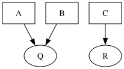
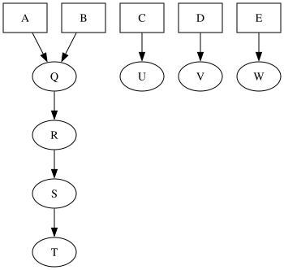

<!-- markdownlint-disable MD013 -->
| Mentor       | Serge                                                              |
| ------------ | -------------------------------------------------------------------|
| Organization | NixOS                                                              |
| Repo         | [github.com/sinanmohd/evanix](https://github.com/sinanmohd/evanix) |

## Description

Here in [evanix](https://github.com/sinanmohd/evanix) we explored making the
scheduling of Nix builds more controllable. In particular, we look into
implementing constraints such as –max-builds and –max-build-time, which ensure
that build operations remain within manageable limits while maximizing throughput.

The scheduling problem here is framed as a mixed integer linear programming
(MILP) problem. The input is a graph G=(V,E), where each vertex v represents a
Nix package with a cost w(v) and a value p(v). Packages that are classified as
transitive dependencies—those required solely for other packages—carry a value
of 0. In contrast, packages that are requested for direct building are assigned
a value of 1. This value structure reflects the prioritization of building
requested packages over their dependencies.

Our approach aims to identify a set of vertices or packages following the
[precedence constraints](https://link.springer.com/article/10.1023/A:1004649425222)
that maximizes the value or the number of packages built with value 1. It is
crucial that a vertex or package can only be selected if all of its dependencies
are also selected. An edge in the graph represents a dependency, with the
indegree of a vertex denoting the number of packages that depend on it and the
outdegree representing the number of dependencies of the package.

We also developed a linear regression model to predict build times based on
input derivations, enabling us to incorporate this information into our solver
when it’s unavailable in [Hydra](https://github.com/NixOS/hydra). This
predictive modeling greatly enhances our ability to estimate build durations
for packages not built by [Hydra](https://github.com/NixOS/hydra), particularly
those outside of Nixpkgs. By integrating these predictive insights with our
MILP-based scheduling strategy, we aim to create a more robust nix build
scheduler.

## What was done

- Utilize mixed-integer programming to approximate the most optimal solution
  efficiently, using the
  [HiGHS](https://ergo-code.github.io/HiGHS/dev/interfaces/c_api) solver.
- Maximize the number of requested packages produced within a specified budget,
  with a maximum constraint of n builds.
- Maximize the number of requested packages produced within a specified budget,
  constrained by a maximum time limit of t.
- Utilize data from Hydra to estimate the build times for derivations.
- Develop a linear regression model to estimate build times for derivations
  when such data is unavailable in [Hydra](https://github.com/NixOS/hydra).
- Implement unit tests using Meson’s built-in testing framework, and
  integration tests utilizing the NixOS integration testing framework.
- Implement a pipelined architecture to initiate the building of derivations
  immediately following their evaluation.

## Work for the future

- Enhance the linear regression model and conduct additional tests to validate
  its performance and accuracy.
- Integrate the linear regression model with evanix.

## Milestones

### SJF Scaffolding

The first solver implemented in evanix is the Greedy Shortest Job First (SJF),
which is an approximate and heuristic-based solver. This solver selects the job
with the least cost in each step to maximize throughput. The SJF solver can
function perfectly if the requested jobs do not share dependencies. However, it
falls apart when they do. An example is given in Figure 1.

In the above DAG, if we’re given enough resources to build 3 packages, SJF
would only be able to build 1 (C), instead of 2 if we were to choose A, B, Q.
But this naive solver was crucial in scaffolding the rest of the evanix code,
allowing us to subsequently develop a more sophisticated solver.

### Conformity

While this solver is again an approximate and heuristic-based solver, it allowed
us to refactor the evanix code to support multiple solvers. Being unfamiliar
with HIGHS, we didn’t want to debug simultaneously the interaction with highs
and the interaction with nix, so we decided to start with the simpler heuristic
solver, so we can work on one thing at a time.

Here we use a concept called “conformity”. Conformity is a ratio between the
number of direct feasible derivations sharing dependencies of our derivation and
the total number of dependencies of our derivation. In each step we eliminate
all packages that cost more resources than we can allocate, then we select the
package with the highest conformity score. If conformity is the same for some
packages then we select the package with the least cost.

Higher the conformity, more the package will help other packages in our DAG,
this gives packages in a cluster higher chance to be selected than isolated
packages. This also has the advantage that our DAG will be quickly reduced to
isolated packages. But being an approximate and heuristic-based solver, it has
its own problems. In Figure 2 the algorithm will choose to build A & B if given
enough resources to build 6 packages, being only able to build 2 packages
instead of 3 if we were to choose D, C, & E.

### [Precedence Constrained Knapsack](https://link.springer.com/article/10.1023/A:1004649425222)

The knapsack problem is a well-known integer programming problem that involves
selecting items with given values and weights to maximize the total value
without exceeding a weight capacity.

We’re dealing with a variant of the Knapsack problem, where additional
constraints are imposed. These constraints, referred to as
[precedence constraints](https://link.springer.com/article/10.1023/A:1004649425222),
introduce a new layer of complexity to the problem. It was not immediately
obvious if all of the DAG constraints fit into the linear programming framework.
It took us at least a week to figure out that the dependency characteristics of
the DAG were essentially just inequality constraints, a crucial insight that
[Serge](https://github.com/SomeoneSerge) was the first to identify. This is a
known combinatorial NP-hard problem.

We choose [HiGHS](https://ergo-code.github.io/HiGHS/dev/interfaces/c_api/) as
our mixed-integer linear programming (MILP) solver due to its established
presence in numerous prominent open-source projects, such as
[SciPy](https://scipy.org/). This choice is supported by HiGHS’ reputation for
efficiency and robustness, which aligns well with our requirements.

#### [Hydra](https://github.com/NixOS/hydra) Data

Now that we have a proper solver implemented in evanix, essentially covering the
`--max-builds` functionality, the next step was to implement `--max-time`. The
evanix code required very little refactoring for this. most of this phase was
spent addressing the data itself. We do not delve into how the estimation
affects systems with different resources. The first step was gaining access to
the historical data in Hydra. Huge thanks to the NixOS infrastructure team for
providing us with all the help we needed, especially
[Hexa (Martin Weinelt)](https://discourse.nixos.org/u/hexa). The PostgreSQL dump
contained about 30GB of data.

We built a recursive crawler to fetch dependencies for each derivation after
evaluating Nixpkgs. Even if the derivation path was available in the dump, the
`.drv` files themselves were not included. Thus, we established a simple mapping
from `pname` to build duration. However, for packages that are not in Nixpkgs,
we predict their build time using input derivations through a linear regression
model developed with [SciPy](https://scipy.org/). In this model, the independent
variables form an mxn matrix of `pnames` and each derivation. If an input
derivation required a particular `pname`, we set the value to 1 and 0 if it did
not. The dependent variables consist of a vector of build durations.

## Tests

evanix uses `nix-build` and `nix-eval-jobs`. While the meson built-in testing
framework facilitates straightforward unit testing, evanix’s integration testing
process is complicated by its reliance on the actual Nix store, derivation (drv)
files, and substituters. This reliance on real components presents significant
hurles for integration testing. Our approach with Nix necessitates the
provisioning of all required real components within a sandboxed environment,
further complicating the integration testing landscape. To mitigate these
complexities, we employed a domain-specific language (DSL) based on Nix to
streamline the creation of test cases. [Serge](https://github.com/SomeoneSerge)’s
expertise was instrumental in developing the evanix test infrastructure.

## Acquiring new skills

During the GSoC period, I acquired a wide range of skills, including how to
properly conduct integration tests. I gained insights into optimization
problems, various types and solvers, as well as integer programming, linear
programming, and mixed-integer linear programming. Additionally, I got a chance
to implement many programming concepts that I had only read about in books, such
as solving the producer-consumer problem using semaphores, which I had only read
about in my university textbook two months prior. The best part was implementing
everything in C, allowing me to experience these concepts from a lower-level
perspective.

## GSoC: The experience

Exploring different solutions with my mentor was the most exciting aspect of
GSoC, and then seeing them come to life after implementation. If you’re aspiring
to become a GSoC contributor, select an open-source project that interests you,
**use it**, and identify areas for improvement, and start contributing.

Huge thanks to Serge for guiding me all the way through. your expertise,
feedback, encouragement, and enthusiasm were extremely valuable to me. I learned
lots of real-world skills, and most importantly, I had fun.
